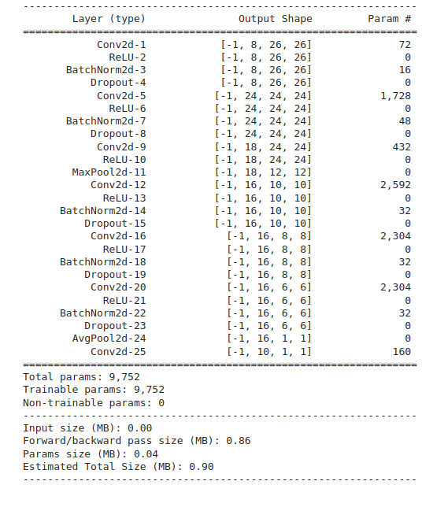
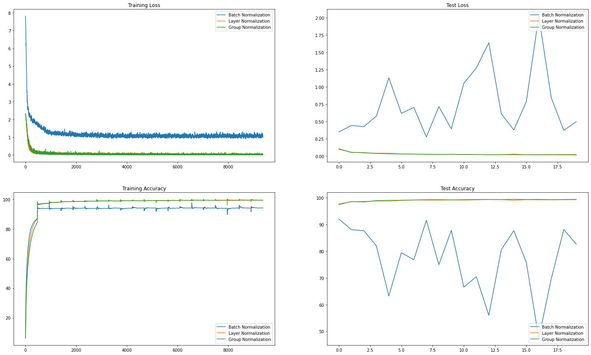
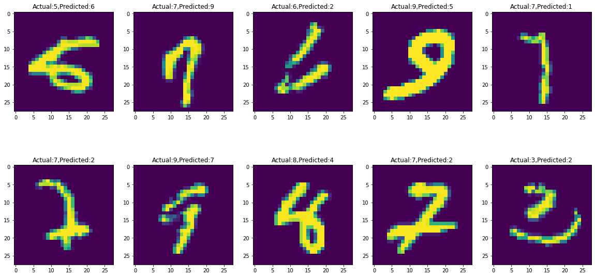
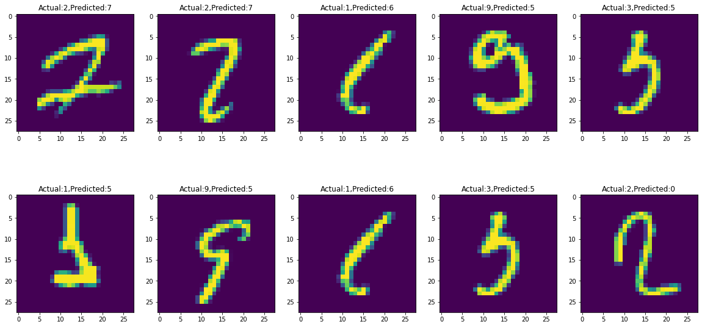

# Model
### Following is my network's output from torch summary

### Parameters
- Batch size - 128
- Optimizer - Stochastic gradient descent (SGD)
- Dropout - 0
- Scheduler - None
- Normalization techniques  

| Technique                  |   Best training accuracy | Best test accuracy  |  L1 factor | number of groups |
|:--------------------------:|:------------------------:|:-------------------:|:----------:|:----------------:|
| L1 + Batch normalization   | 94.19% at 20th Epoch     | 92.01% at 1st epoch |    0.01    |       0          |    
| Layer normalization        | 99.35% at 19th Epoch     | 99.29% at 13th epoch|    0       |       0          |    
| Group normalization        | 99.45% at 19th Epoch     | 99.37% at 15th epoch|    0       |       8          |    

# Files
- [model.py](https://github.com/DimpleB0501/eva8/blob/main/Session5_normalization/model.py) file includes GN/LN/BN and takes an argument to decide which normalization to use.
- [Session_5_Assignment_QnA.ipynb](https://github.com/DimpleB0501/eva8/blob/main/Session5_normalization/Session_5_Assignment_QnA.ipynb) is a single notebook file to run all the above 3 models for 20 epochs each.

# Normalization techniques brief explanation
Normalization refers to the process of standardizing inputs to a neural network. Different normalization techniques can standardize different segments of the input.

Batch normalization - standardizes each mini-batch input to a layer.
Layer normalization - normalizes the activations along the feature/channel direction instead of the batch direction. Removes depdency on batch size.
Group normalization - similar to layer normalization, however, it divides the features/channels into groups and normalizes each group separately.
# Analysis 

# 10 misclassified images for each of the 3 models
##### Network with L1 + BN

##### Network with Layer Normalization

##### Network with Group Normalization

