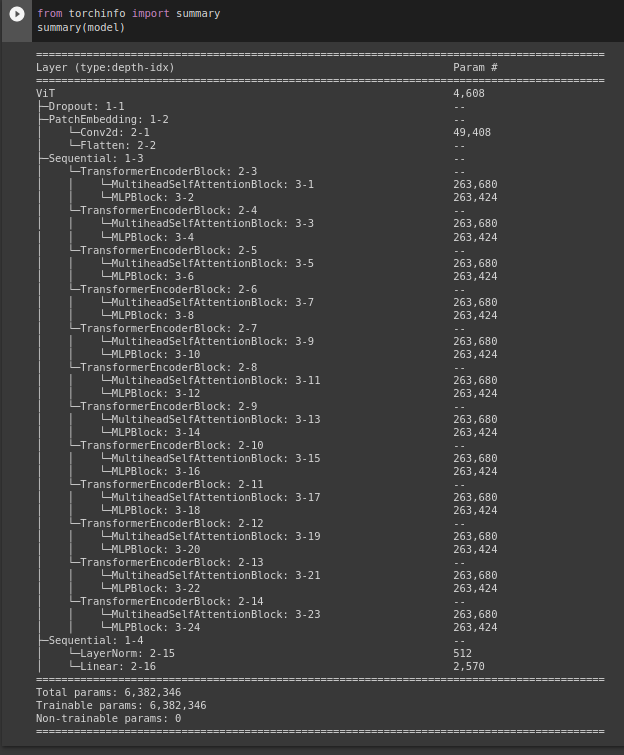
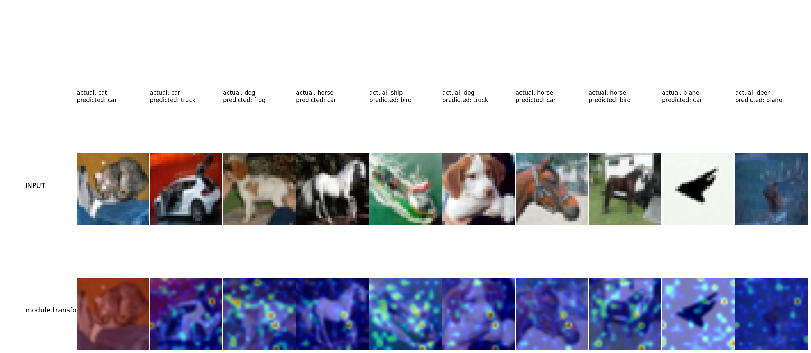

### Model
I trained the model using the [sample code](https://drive.google.com/file/d/1Lg1KhpHfogQORxYljuNroPX8riC2AC-E/view) provided in the class.  
I used **Table 1** in [paper](https://paperswithcode.com/paper/tokens-to-token-vit-training-vision/review/) to modify ViT's hyperparameters  
Following is my ouput from torch summary

### Training logs
ConvMixer: Epoch: 0 | Train Acc: 0.3120, Test Acc: 0.4203, Time: 98.9, lr: 0.001000  
ConvMixer: Epoch: 1 | Train Acc: 0.3681, Test Acc: 0.3895, Time: 88.7, lr: 0.002000  
ConvMixer: Epoch: 2 | Train Acc: 0.2971, Test Acc: 0.3180, Time: 89.1, lr: 0.003000  
ConvMixer: Epoch: 3 | Train Acc: 0.2565, Test Acc: 0.2613, Time: 86.9, lr: 0.004000  
ConvMixer: Epoch: 4 | Train Acc: 0.2344, Test Acc: 0.2567, Time: 87.7, lr: 0.005000  
ConvMixer: Epoch: 5 | Train Acc: 0.2230, Test Acc: 0.2731, Time: 88.9, lr: 0.006000  
ConvMixer: Epoch: 6 | Train Acc: 0.2304, Test Acc: 0.2388, Time: 85.5, lr: 0.007000  
ConvMixer: Epoch: 7 | Train Acc: 0.2205, Test Acc: 0.2556, Time: 87.7, lr: 0.008000  
ConvMixer: Epoch: 8 | Train Acc: 0.2173, Test Acc: 0.2393, Time: 87.2, lr: 0.009000  
ConvMixer: Epoch: 9 | Train Acc: 0.2146, Test Acc: 0.2472, Time: 89.6, lr: 0.010000  
ConvMixer: Epoch: 10 | Train Acc: 0.2208, Test Acc: 0.2562, Time: 86.5, lr: 0.009050  
ConvMixer: Epoch: 11 | Train Acc: 0.2321, Test Acc: 0.2697, Time: 88.1, lr: 0.008100  
ConvMixer: Epoch: 12 | Train Acc: 0.2233, Test Acc: 0.2434, Time: 85.5, lr: 0.007150  
ConvMixer: Epoch: 13 | Train Acc: 0.2221, Test Acc: 0.2560, Time: 87.9, lr: 0.006200  
ConvMixer: Epoch: 14 | Train Acc: 0.2237, Test Acc: 0.2616, Time: 85.7, lr: 0.005250  
ConvMixer: Epoch: 15 | Train Acc: 0.2316, Test Acc: 0.2789, Time: 88.7, lr: 0.004300  
ConvMixer: Epoch: 16 | Train Acc: 0.2332, Test Acc: 0.2787, Time: 86.2, lr: 0.003350  
ConvMixer: Epoch: 17 | Train Acc: 0.2322, Test Acc: 0.2630, Time: 87.4, lr: 0.002400  
ConvMixer: Epoch: 18 | Train Acc: 0.2334, Test Acc: 0.2702, Time: 86.5, lr: 0.001450  
ConvMixer: Epoch: 19 | Train Acc: 0.2438, Test Acc: 0.2858, Time: 91.3, lr: 0.000500  
ConvMixer: Epoch: 20 | Train Acc: 0.2484, Test Acc: 0.2840, Time: 89.6, lr: 0.000400  
ConvMixer: Epoch: 21 | Train Acc: 0.2503, Test Acc: 0.2874, Time: 87.9, lr: 0.000300  
ConvMixer: Epoch: 22 | Train Acc: 0.2519, Test Acc: 0.2891, Time: 88.9, lr: 0.000200  
ConvMixer: Epoch: 23 | Train Acc: 0.2504, Test Acc: 0.2904, Time: 91.8, lr: 0.000100  
ConvMixer: Epoch: 24 | Train Acc: 0.2537, Test Acc: 0.2905, Time: 88.8, lr: 0.000000  

### Gradcam output for 10 misclassfied images

