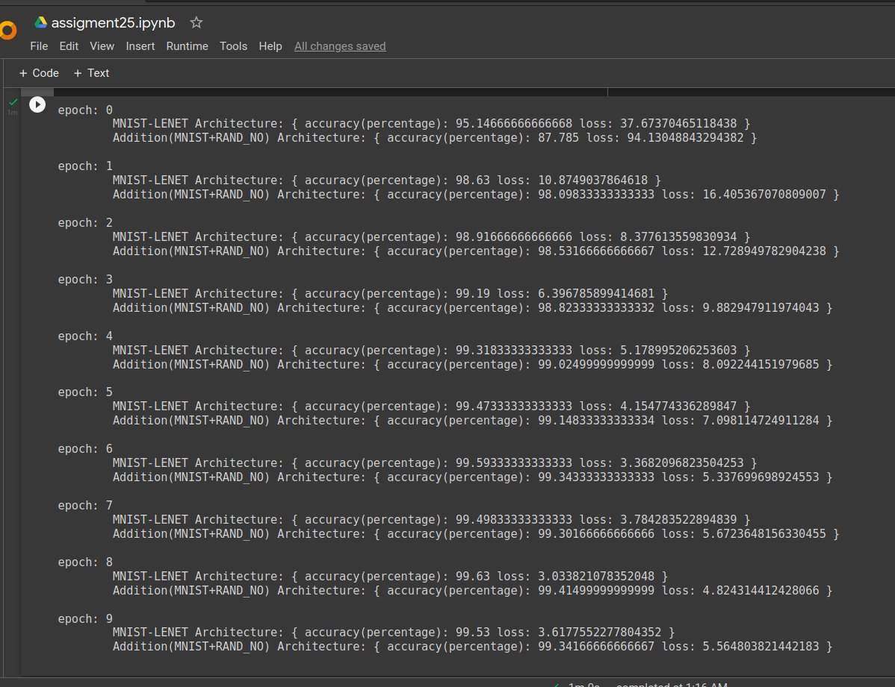

# Assignment

# Solution
### First step - Create a custom data set
The first step in the assignment was to create a custom dataset that displays  
- MNIST image  
- MNIST label 
- Generates a random number - one hot encoded (28x28) 
- Addition Label (MNIST label + Random number) 
Following images displays the custom dataset creation block in my colab notebook  

### Model and training
Following are my training logs:

I have followed this [blog](https://github.com/zaidalyafeai/Machine-Learning/blob/master/Multi-input%20Network%20Pytorch.ipynb) to develop a neural network model thats adds 2 inputs.  
The 2 inputs to my models from the custom dataset are  
- MNIST image(28x28) 
- One hot encoded randomly generated integer (0-9) (28x28) 
There are 2 outputs from my model 
- MNIST image based number classifier 
- addition output of an MNIST image and random number 

For visualization purpose I have tested the trained model on an image in the training set . Following image displays the ouput of the test:

