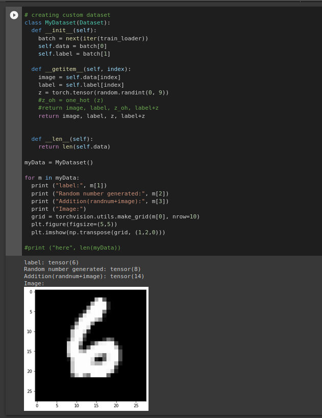

# Assignment

# Solution
### First step - Create a custom data set
The first step in the assignment was to create a custom dataset that displays  
- MNIST image  
- MNIST label 
- Generates a random number - one hot encoded (28x28) 
- Addition Label (MNIST label + Random number) 
Following images displays the custom dataset creation block in my colab notebook  

