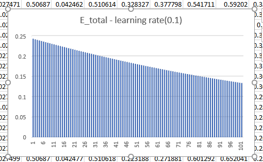

# Question
PART 1[250]: Rewrite the whole excel sheet showing backpropagation. Explain each major step, and write it on Github.  
Use exactly the same values for all variables as used in the class  
Take a screenshot, and show that screenshot in the readme file  
The Excel file must be there for us to cross-check the image shown on readme (no image = no score)  
Explain each major step  
Show what happens to the error graph when you change the learning rate from [0.1, 0.2, 0.5, 0.8, 1.0, 2.0]  
Upload all this to GitHub and then write all the above as part 1 of your README.md file.  
Submit details to S4 - Assignment QnA.  

# Solution
In session 3 we worked on writing a simple neural network in excel sheet.  
We derived the formulas for forward and backward propogation using partial derviates. Following are the derived formulas  

 
We started with the weights displayed in the figure.  
At each step we updated the weights using the learning rate. The formula for weight update is  `weight_new = weight_old - (learning_rate x ꝺE/ꝺweight_old)`  
Following [excel sheet](https://github.com/DimpleB0501/eva8/blob/main/Session_3/nn_excel.ods) contains my work on building a simple neural network for the Assignment 3 part 1. Following figure displays the screenshot of the excel sheet   

2. Graphs of the learning rate  
- Learning rate= 0.1  

- Learning rate= 0.2  

- Learning rate= 0.5  

- Learning rate= 0.8  

- Learning rate= 1  

- Learning rate= 2  

