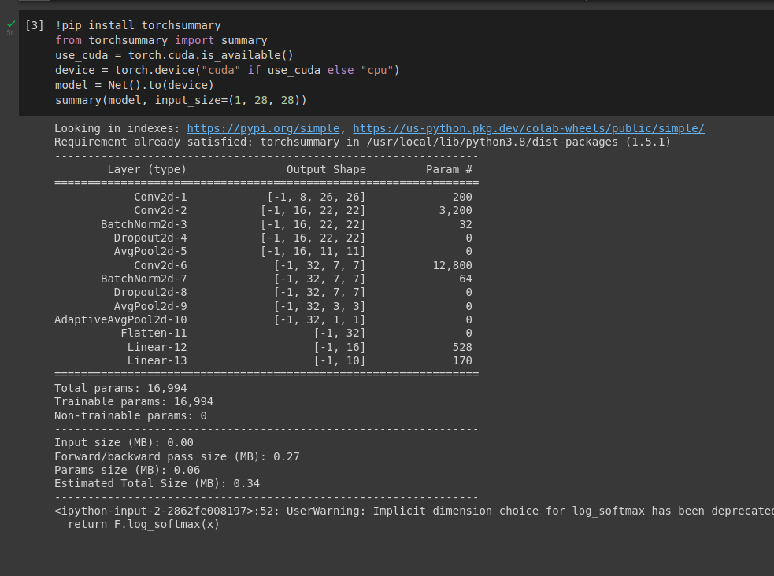
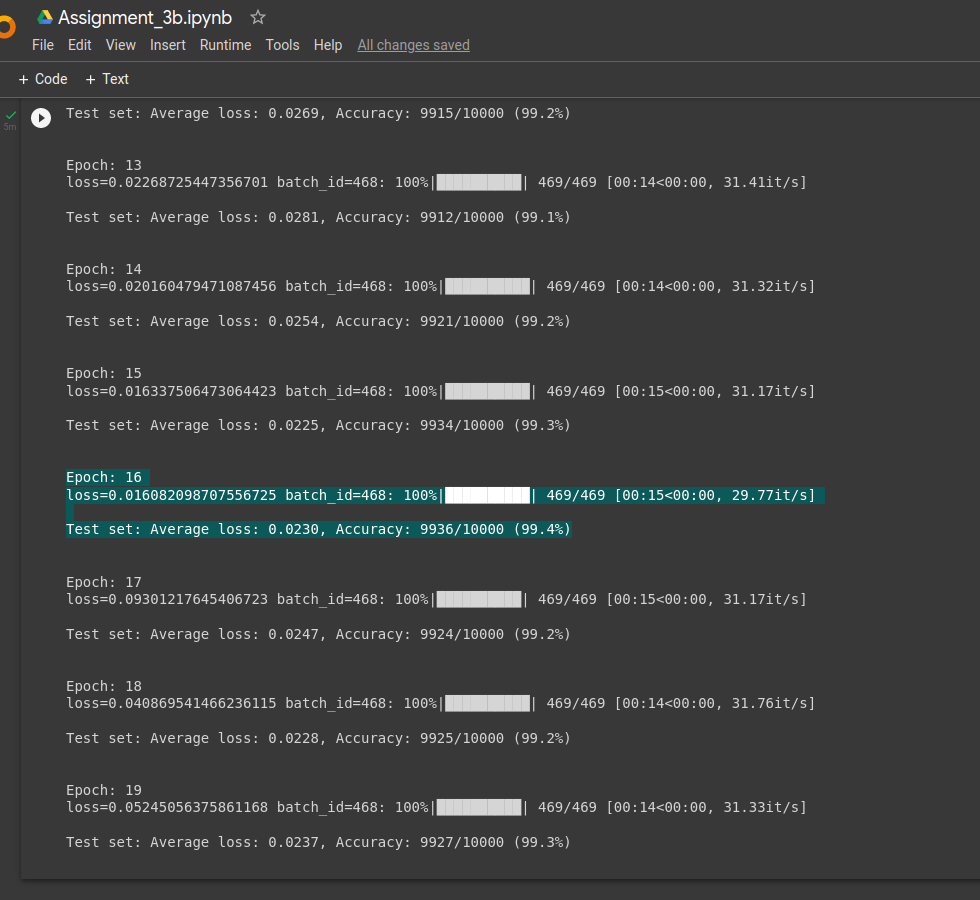

# Assignment Part 2
Q. WRITE The given code AGAIN SUCH THAT IT ACHIEVES 
- 99.4% validation accuracy 
- Less than 20k Parameters 
- Less than 20 Epochs 
- Have used BatchNormalization, Dropout, a Fully connected layer, have used GAP.  
##### Solution
I started with modification of the [LENET](https://www.analyticsvidhya.com/blog/2021/03/the-architecture-of-lenet-5/) architecture.  
My network consists of 3 convolution layers, 2 fully connected layers, average pooling layers, batch normalization, dropout  and GAP layer (which I have added using `self.gap = torch.nn.AdaptiveAvgPool2d((1,1))` function). 
The total number of parameters in my network are **16,994 (< 20k)**  
Following figure displays output from **torchsummary**  

I received an accuracy of 99.4% at the **16th** epoch.

