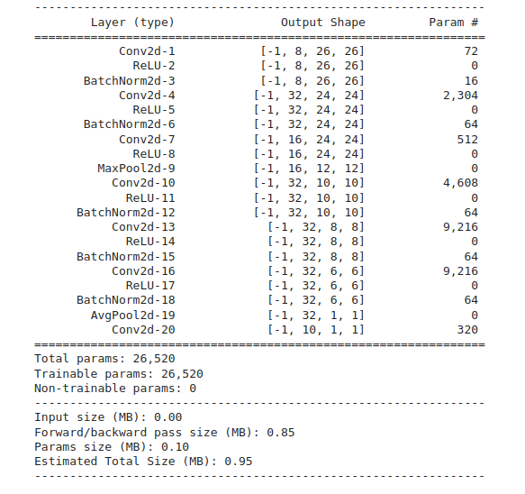
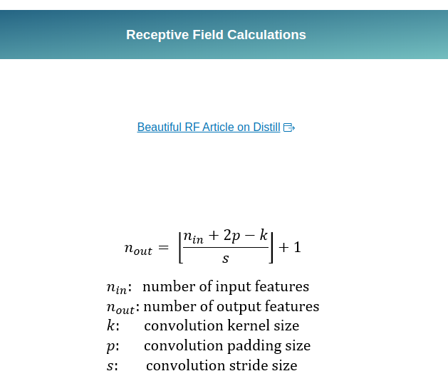

# Code 0 - Skeleton code
Following is my network architecture  

The **results** of my model are  
- Number of parameters **26,520**,
- Max training accuracy **99.78 %** at 13 epoch,
- Max test accuracy **99.39 %** at 15 epoch.  

### Receptive field calculation
##### Formula to calculate the receptive field

##### Receptive field calculation for my model
| Layer   | Kernel|Padding|Stride|       | j_in  |  s_in | s_out | RF    | j_out |
|:-------:|:-----:|:-----:|:----:|:-----:|:-----:|:-----:|:-----:|:-----:|:-----:|
| Input   |       |       |      |       |     1 |       |    28 |     1 |      1|
| Conv1   |    3  |   0   |     1|       |     1 |     28|    26 |     3 |      1|
| Conv2   |    3  |   0   |     1|       |     1 |     26|    24 |     5 |      1|
| Conv3   |    1	|   0   |     1|       |     1 |     24|    24 |     5 |      1|
| Max pool|    2  |   0   |     2|       |     1 |     24|    12 |     6 |      2|
| Conv4   |    3  |   0   |     1|       |     2 |     12|    10 |    10 |      2|
| Conv5   |    3  |   0   |     1|       |     2 |     10|     8 |    14 |      2|
| Conv6		|    3  |   0   |     1|       |     2 |      8|     6 |    18 |      2|
| GAP     |    6  |   0   |     1|       |     2 |      6|     1 |    28 |      2|
| Conv7		|    1  |   0   |     1|       |     2 |      1|     1 |    28 |      2|

# Code 1 - Lighter weight model (base code)
My network (from skeleton code) has 
- batch normalization, 
- GAP layer, 
- convolutional layer after gap to increase the capacity of the network, and
- A max pooling layer after receptive field of 5
- 
### **Target**
- Reduce the number of parameters in the network by reducing the number of layers in the network 
### **Results**
- Parameters - 9,752
- Best training accuracy - 99.58 %
- Best test accuracy - 99.31% at 15th Epoch
### **Analysis**
- Number of parameters is within the desired range (< 10k).
- Overfitting is observed. Model's training accuracy increases consistently however the test accuracy remains in the range of 99.28-99.3 %.

# Code 2 - Adding dropout layer
### **Target**
Adding dropout layers (dropout value = 0.1) to handle overfitting
### **Results**
- Parameters -  9,752
- Best training accuracy - 99.08 % (consistent after epoch 11)
- Best test accuracy - 99.32 % (at 11th epoch)
### **Analysis**
- Adding dropout layer has introduced stability in the training dataset. However the test dataset accuracy stops increasing after 11th epoch and toggles between 99.25-99.32%. Thus adding dropout layer doesn't have a significant effect on the test accuracy. 

# Code 3 - Adding data augmentation and StepLR
### **Target**
- Implementing data augmentation (rotation with -7 to 7 degrees range)
- Implementing learning rate scheduler from the 6th epoch
- Removing dropout
### **Results**
- Parameters - 9,752
- Best training accuracy - 99.43 %
- Best test accuracy - 99.49 % (very consistent after 7th epoch)
### **Analysis**
- After adding data augmentation and LR scheduler model is not overfitting.
- Also the accuracy is increasing.
