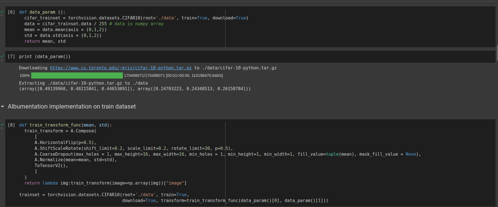
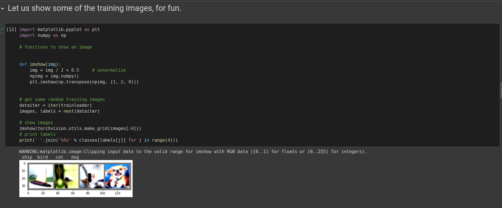
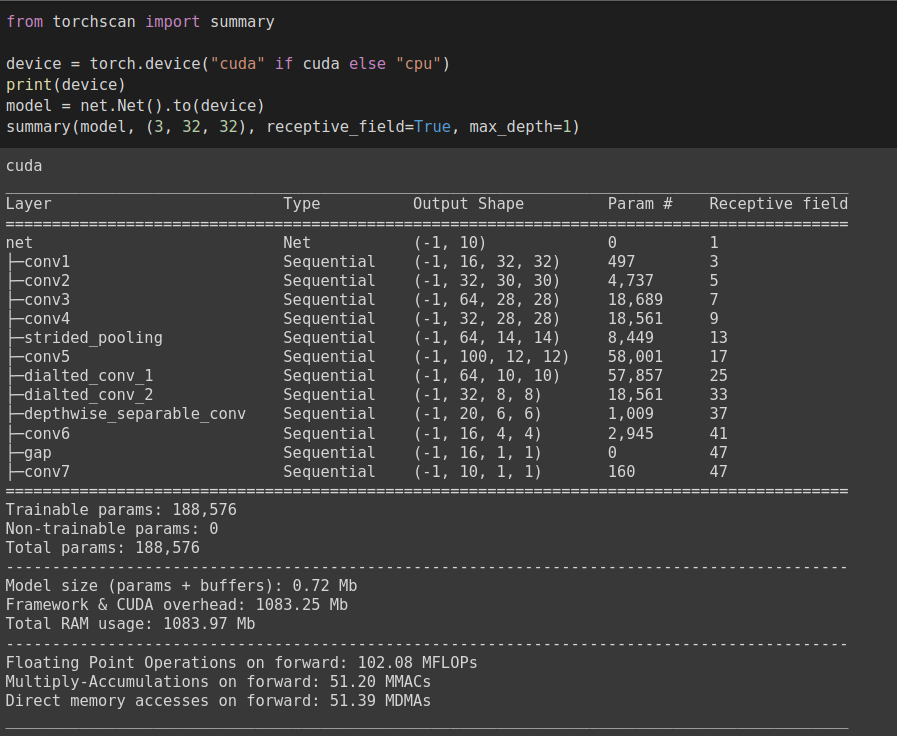
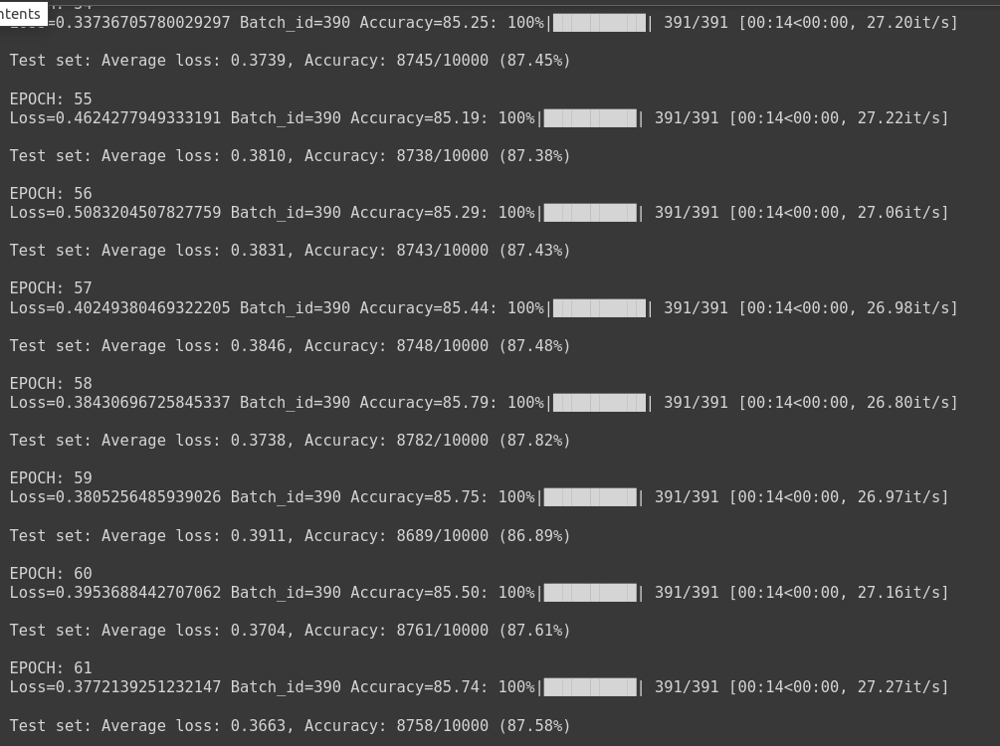
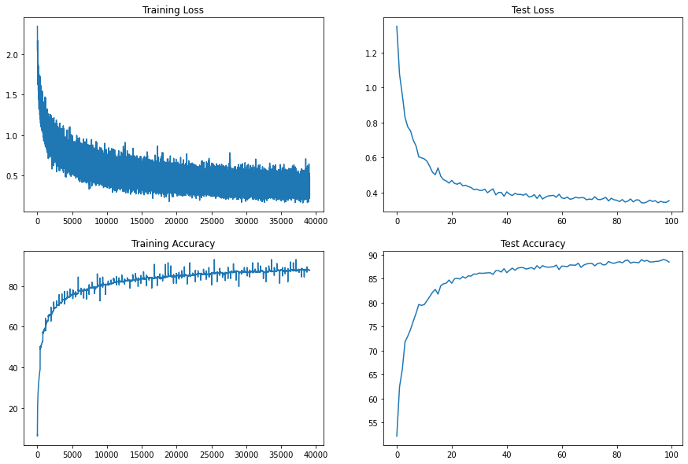
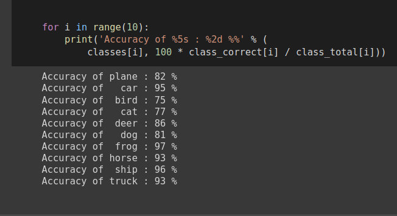

# Assignment 
Design a network CIFAR 10 dataset 

# Solution
### Using albumentation library and apply on training dataset:
- horizontal flip
- shiftScaleRotate
- coarseDropout (max_holes = 1, max_height=16px, max_width=1, min_holes = 1, min_height=16px, min_width=16px, fill_value=(mean of your dataset), mask_fill_value = None)
##### Implementation

### Model
My model has 6 convolution layers (with 3x3 kernels), 2 dilated convolution layers, 1 depthwise separable convolution layer, a convolution layer implemented as max pool layer (kernel_size=(2, 2), stride = 2, padding=2, dilation = 4), a gap layer followed by a convolution layer. 
##### Files
- [model.py](https://github.com/DimpleB0501/eva8/blob/main/Session_6_Assignment_QnA/model.py) file includes my network.
- [Session_6_Assignment_QnA.ipynb](https://github.com/DimpleB0501/eva8/blob/main/Session_6_Assignment_QnA/Session_6_Assignment_QnA.ipynb) is a single notebook file where model.py file needs to be uploaded.

##### Model parameters
Achieved specifications
- Receptive field = 47 (> 44) 
- Total Params = 188,576 (to be less than 200k)

### Training log
- Trained and validated for 100 epochs
- 85.25 % training accuracy acheived at 54 epoch
- 85.42% % test accuracy acheived at 24 epoch

##### Plot train and test accuracies

### CIFAR10 class performance 

