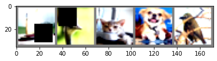
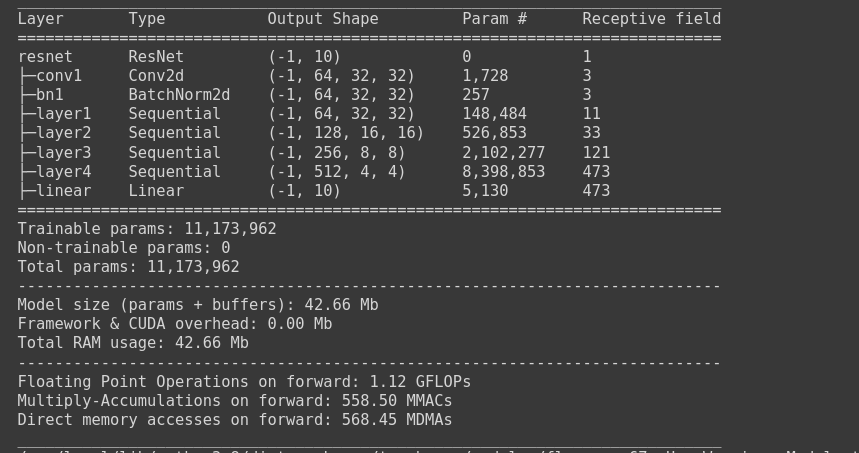
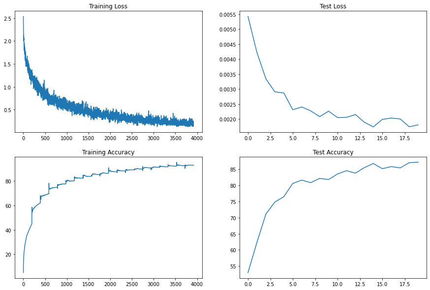
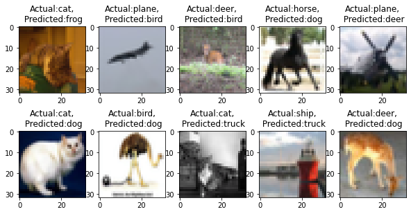
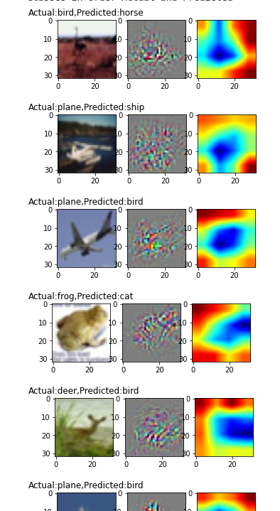
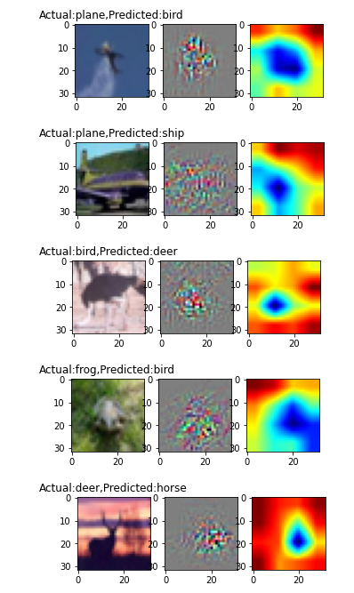

# Structure code and pull it from github
### Data augmentation
- RandomCrop(32, padding=4)
- CutOut(16x16)  

### Train resnet18 for 20 epochs on the CIFAR10 dataset
- Number of epochs - 20 epochs
- Batch size - 256
- Optimizer - SGD
- Criterion - CrossEntropyLoss
- Best training accuracy - 92.80 % at 20th epoch
- Best test accuracy - 87.22% at 20th epoch

### Show loss curves for test and train datasets

### Show a gallery of 10 misclassified images

### Show gradcam output on 10 misclassified images

