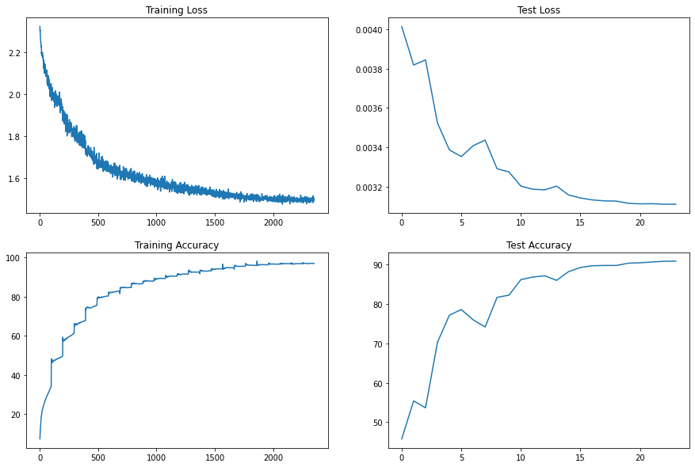
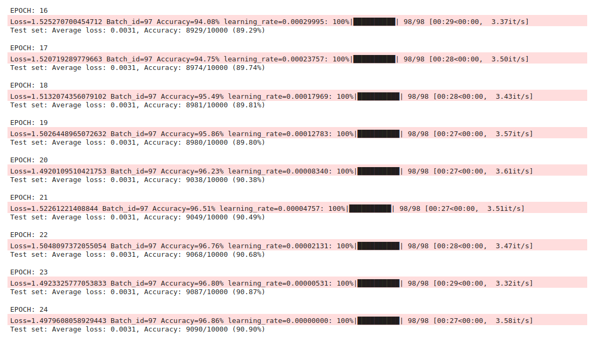

### Writing a custom resnet architecture for CIFAR10

### Applying data transforms for train data set
- Padding of 4  
- RandomCrop 32, 32  
- FlipLR (Horizontal flip)   
- CutOut(8, 8)   

### Hyperparameters
- Number of epochs - 24
- Batch size - 512
- Optimizer - Adam 
- Scheduler - One Cycle Policy 
  - Max learning rate at 5th Epoch  
  Set pct_start of [pytorch's OneCycleLR](https://pytorch.org/docs/stable/generated/torch.optim.lr_scheduler.OneCycleLR.html) to 0.2 (5/24 epoch)  
  
  - Maximum learning rate set to **0.0008111308307896874**. This learning rate is calculated by torch-lr-finder package from [pytorch-lr-finder](https://github.com/davidtvs/pytorch-lr-finder)
  
  
### Losses and accuracy
- Maximum Training accuracy - 96.86%
- Maximum test accuracy - 90.90%

### Training logs

