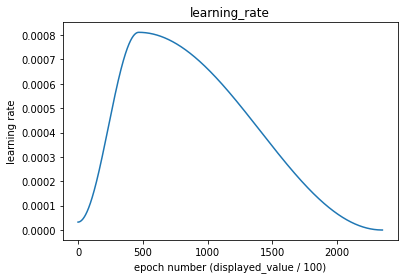

### Writing a custom resnet architecture for CIFAR10

### Applying data transforms for train data set
- Padding of 4
- RandomCrop 32, 32
- FlipLR (Horizontal flip) 
- CutOut(8, 8)

### Hyperparameters
- Number of epochs - 24
- Batch size - 512
- Optimizer - Adam 
- Scheduler - One Cycle Policy 
  - Max learning rate at 5th Epoch  
  Set pct_start of [pytorch's OneCycleLR](https://pytorch.org/docs/stable/generated/torch.optim.lr_scheduler.OneCycleLR.html) to 0.2 (5/24 epoch)  
  
